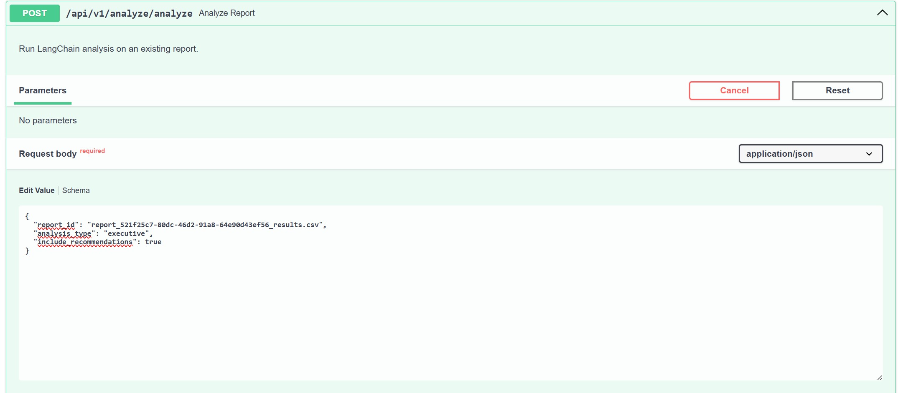
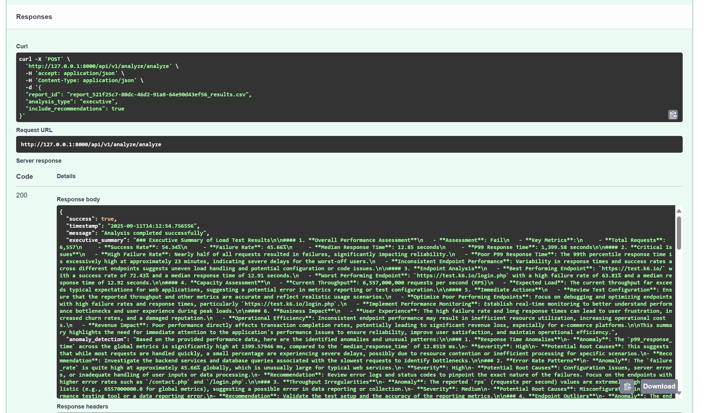
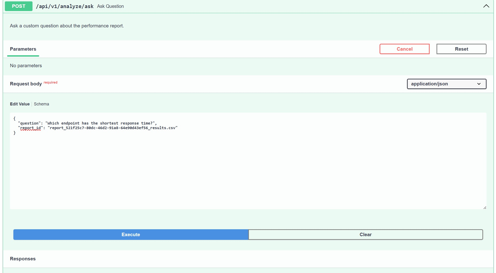
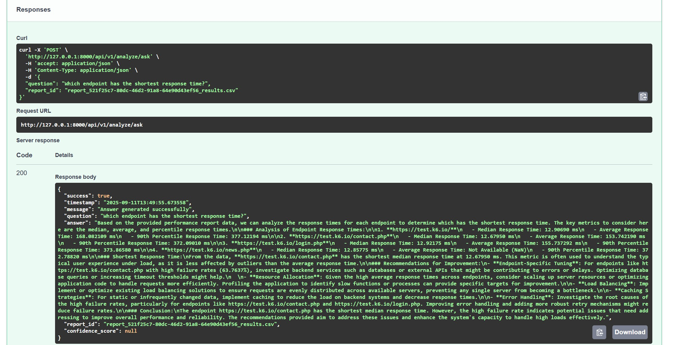

# 🚀 Log Analyzer & Performance Insights Platform  

A FastAPI-based system for **log ingestion, performance report generation, and AI-powered analysis** using LangChain & OpenAI.  

The platform enables teams to:  
- Upload test logs (CSV/JSON)  
- Normalize & ingest into PostgreSQL  
- Generate rich HTML performance reports with plots  
- Summarize & analyze results using LLMs (LangChain + OpenAI)  
- Ask natural language questions about performance metrics  

---

## ✨ Features  

✅ **File Upload & Ingestion**  
- Upload CSV/JSON logs  
- Normalize & store request-level logs in PostgreSQL  
- Full rollback on ingestion errors  

✅ **Report Generation**  
- Compute global & endpoint metrics  
- Generate HTML reports with tables & plots  

✅ **LangChain Analysis**  
- Summarize reports into **executive summaries**  
- Detect anomalies in performance data  
- Generate **optimization recommendations**  
- Interactive Q&A on reports with retrieval-augmented generation (RAG)  

✅ **API Endpoints**  
- `/health` → System health check  
- `/upload` → Upload logs for ingestion  
- `/ingestion/{job_id}` → Begin ingestion job  
- `/report/{file_id}` → Generate & fetch reports  
- `/analysis` → Full AI-powered report analysis  
- `/ask` → Ask performance-related questions  

---

## 🛠️ Tech Stack  

- **Backend**: FastAPI  
- **Database**: PostgreSQL 
- **Data Processing**: Pandas  
- **Vector DB**: ChromaDB  
- **AI/LLM**: LangChain + OpenAI (Chat & Embeddings)  
- **Visualization**: Matplotlib for plots   

---

## Example Flow

1. Run any K6 test (can also run sample in K6_test/sample_k6_test.js) and get the output in JSON/CSV.
2. POST /upload :
    - upload raw output of k6 test using this endpoint to create ingestion job
3. POST /ingestion/{job_id} :
    - Normalize raw data and Begin data ingesstion in postgres
4. POST /report/{file_id} :
    - Generate html report containing metrics and plots to be fed into langchain (check data/reports for sample)
5. POST /analysis :
    - Enter the report id in body to fetch the complete analysis of the report through langchain:
        - Endpoint analysis
        - Irregularities analysis
        - Capacity Assessment - Current throughput vs expected load
        - Error Rate Patterns
    
    
6. POST /ask :
    - Enter the report id and question in body to ask question about the metrics
    
    

---

## Future Tasks

1. Make Ingestion and Analysis into Celery tasks
2. Add simple UI (streamlit, gradio etc)
3. Add memory to Q&A and tie its model to report (maybe using report_id)